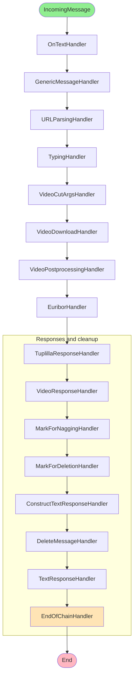

## Handlers

```mermaid
flowchart TD
    IncomingMessage([IncomingMessage]) --> OnText[OnTextHandler]
    OnText --> Generic[GenericMessageHandler]
    Generic --> URLParsing[URLParsingHandler]
    URLParsing --> Typing[TypingHandler]
    Typing --> VideoCutArgs[VideoCutArgsHandler]
    VideoCutArgs --> VideoDownload[VideoDownloadHandler]
    VideoDownload --> VideoPostprocessing[VideoPostprocessingHandler]
    VideoPostprocessing --> Euribor[EuriborHandler]
    Euribor --> Tupilla[TuplillaResponseHandler]
    
    subgraph "Responses and cleanup"
        Tupilla --> VideoResponse[VideoResponseHandler]
        VideoResponse --> MarkNagging[MarkForNaggingHandler]
        MarkNagging --> MarkDeletion[MarkForDeletionHandler]
        MarkDeletion --> ConstructText[ConstructTextResponseHandler]
        ConstructText --> DeleteMessage[DeleteMessageHandler]
        DeleteMessage --> TextResponse[TextResponseHandler]
        TextResponse --> EndOfChain[EndOfChainHandler]
    end
    
    EndOfChain --> End([End])
    
    style IncomingMessage fill:#90EE90
    style End fill:#FFB6C1
    style EndOfChain fill:#FFE4B5

```